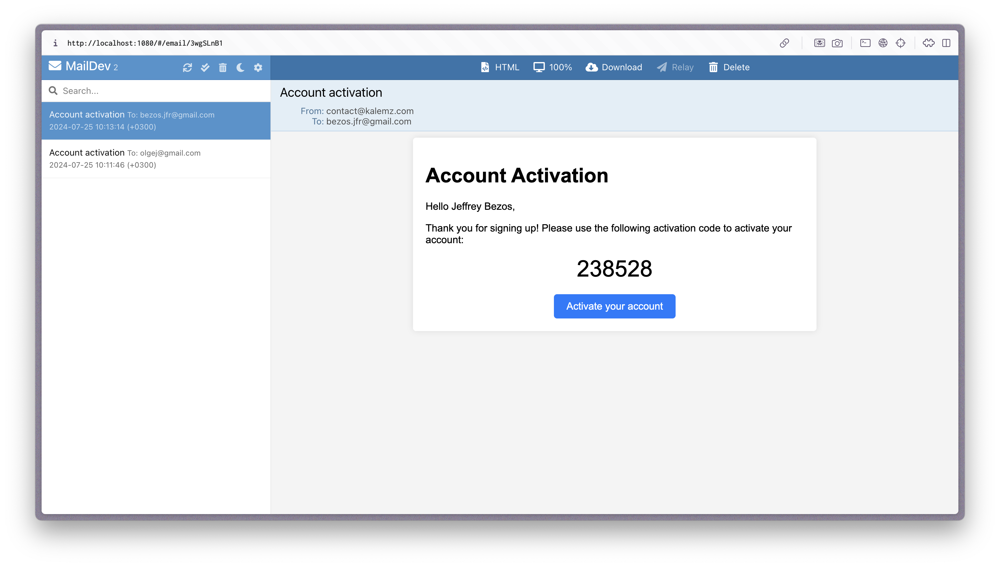

# The Shopper

## Overview

The Shopper is platform that would allow users to create their own customized online stores using a modular approach.

## WORK IN PROGRESS
There is much more to be done. 
Next:
1. Registration with Email 
2. CRUD of shop page
3. Main page
4. Create basic modules
...

## Features

1. User Registration and Authentification
2. Store Creation and Managment with pre-buikt modules, product pages, shopping carts etc.
3. Sales Analytics

## Technology Stack

- Java Spring Boot for Backend
- Angular framework for Frontend
- Docker
- JWT Authentication
